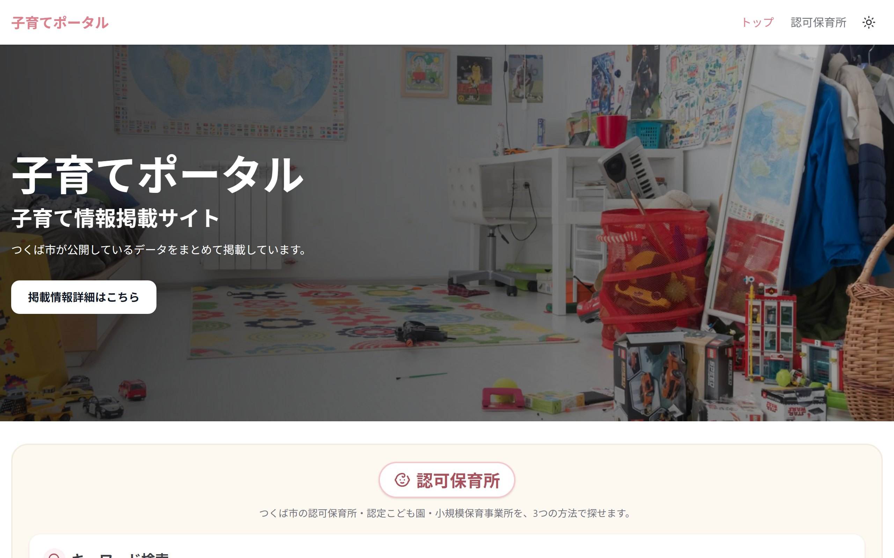
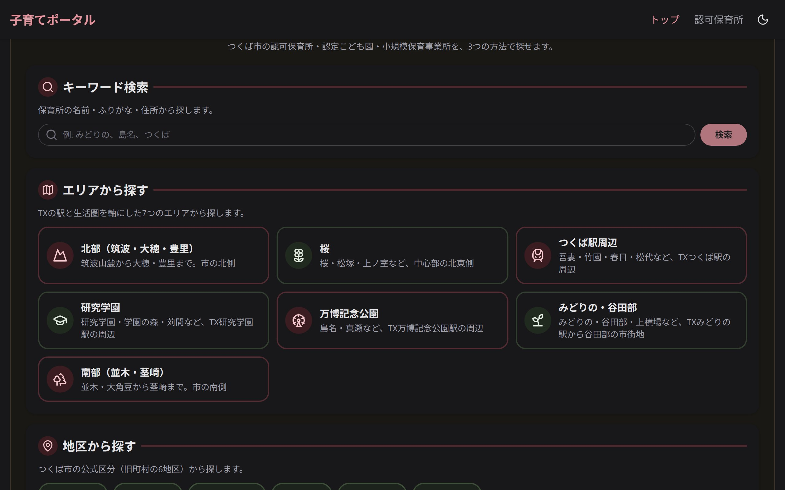
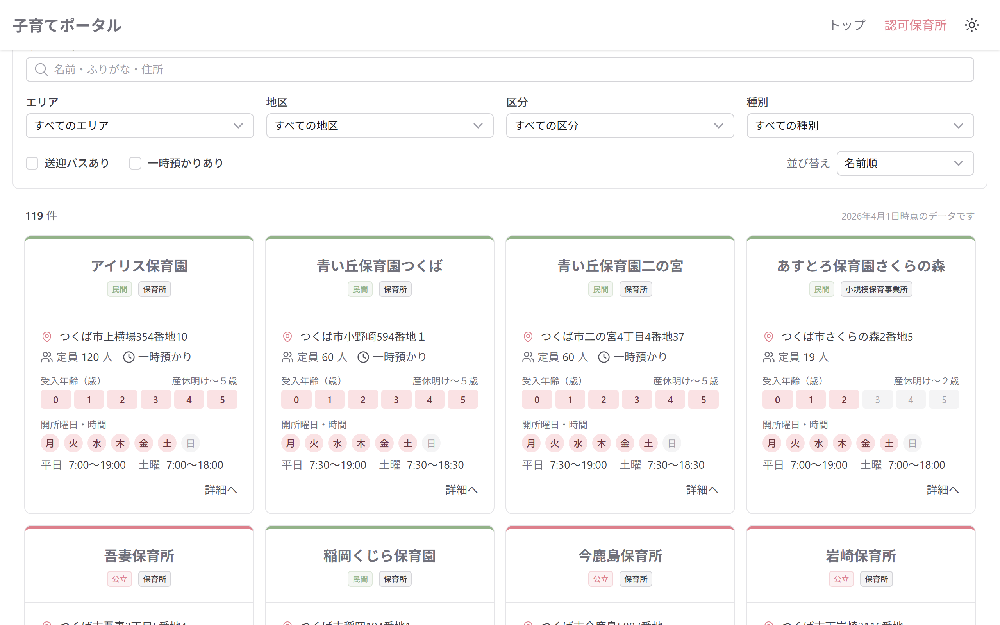
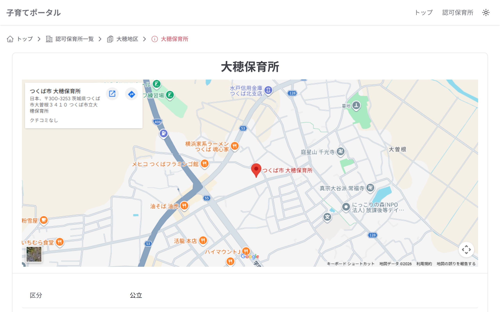
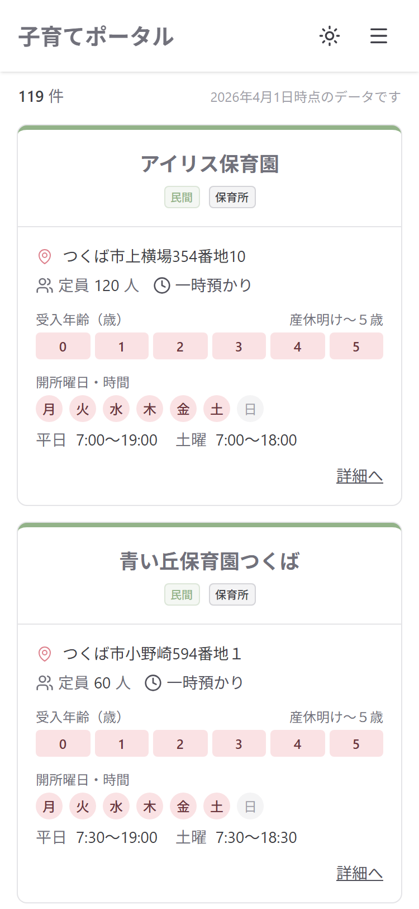

# 子育て支援ポータル


**つくば市の子育て世帯向けに、市が公開しているオープンデータを見やすくまとめたポータルサイト**です。

現在は**認可保育所・認定こども園・小規模保育事業所（119件）**を扱っており、
エリア・地区・キーワードから探し、条件で絞り込み、地図と一緒に詳細を確認できます。

**Nuxt 4 + TypeScript** で構築したフルスタックアプリで、Vercel にデプロイしています。

---

## 🌐 デモサイト

👉 [https://kosodate-portal.coolat.net/](https://kosodate-portal.coolat.net/)

---

## 📌 主な機能

| 機能 | 説明 |
| --- | --- |
| 🔍 キーワード検索 | 名前・ふりがな・住所を横断して検索。ひらがな / カタカナのどちらで打っても引ける |
| 🗺 エリアから探す | TXの駅と生活圏を軸にした7エリア。一覧の主導線 |
| 📍 地区から探す | つくば市の公式区分（旧町村の6地区） |
| 🎛 絞り込み | エリア / 地区 / 区分（公立・民間）/ 種別 / 送迎バス / 一時預かり |
| ↕ 並び替え | 名前順（ふりがな）・近い順・定員順 |
| 🧭 距離表示 | 現在地または大字を基準にした直線距離。位置情報はブラウザの中だけで使い、送信も保存もしない |
| 📄 施設詳細 | 定員・開所時間・保育年齢・送迎バスなどの一覧と、Google Maps の埋め込み |
| 🗓 データ基準日 | 掲載データがいつ時点のものかを施設ごとに表示 |
| 🌓 ライト / ダーク | OS の設定に追従しつつ、ヘッダーのボタンで切り替え |
| 📧 問い合わせ | Nodemailer によるメール送信。reCAPTCHA v3 でスパムを弾く |

絞り込みと並び替えの状態は URL のクエリに入るので、**条件付きの一覧をそのまま共有できます**。

---

## 🛠 使用技術

| 分類 | 採用 |
| --- | --- |
| フロント / バックエンド統合 | Nuxt 4（`^4.5`）、Nitro の API ルート |
| UI | @nuxt/ui 4、Tailwind CSS 4（設定は CSS 側の `@theme`）、@nuxt/image |
| 型 | TypeScript、`vue-tsc` による型チェック（テンプレート内も検査） |
| データベース | MongoDB Atlas + Mongoose |
| セキュリティ | nuxt-csurf（CSRF）、reCAPTCHA v3 |
| その他 | Nodemailer（メール送信）、ESLint（@nuxt/eslint）、Vercel ホスティング |

---

## 💡 設計上の判断

- **絞り込みはクライアント側で行う。** 全119件が既に手元にあり、サーバー検索でしかできないことが無いため。
  往復が無いぶん速く、「打った瞬間に件数が変わる」形にできる。件数が桁で増えたらサーバー検索へ戻す
- **絞り込みの状態は URL のクエリを正とする。** 既定値の条件はクエリに出さず、
  選択肢に無い値は既定に倒す。エリア別・地区別ページでは軸がパスで決まるので、クエリには書かない
- **エリアと地区の2軸を持つ。** 市の公式区分（6地区）は谷田部だけで約半分を占め、絞り込みとして機能しないため、
  TXの駅と生活圏で切り直したエリアを主導線にしている。地区はデータ属性と既存URLのために維持
- **廃止された施設はソフト削除。** 一覧からは外すが詳細ページは残し、閉園である旨を表示する（既存URLを404にしない）
- **色トークンは色相ではなく役割で命名する**（`main` / `sub` / `cream`）。配色を変えるたびに名前と実体がずれるため

判断の経緯は [`docs/`](./docs) と各 issue / PR に残しています。

---

## 📊 データについて

掲載データは**つくば市のオープンデータ（CC BY 4.0）**をもとにしています。

- 取り込みは `scripts/import-nurseries.mjs`。手順とデータソースは
  [`docs/nursery-data-update-plan.md`](./docs/nursery-data-update-plan.md) に残しています
- 施設ごとに**データ基準日（`source_date`）**を持ち、画面にも表示しています
- 定員・開所時間・送迎バスなどは変更されることがあるため、最新は各施設への確認が必要です

---

## ▶️ ローカル開発手順

```bash
git clone https://github.com/RyoheiTanaka/kosodate-portal.git
cd kosodate-portal
npm install
npm run dev
```

`.env.example` をコピーして `.env` を作り、Google Maps API キー、reCAPTCHA のキー、
MongoDB の接続情報、メール送信の設定を入れてください。

> MongoDB は開発用（`kosodate_dev`）と本番用（`kosodate`）を分けています。
> `MONGODB_URI` は DB名を含まない接続文字列、`MONGODB_DB` が接続先のDB名です。
> ローカルの `.env` の `MONGODB_DB` には**必ず `kosodate_dev`** を設定してください。
> 取り込みスクリプトは開発用DB以外への書き込みに `--prod` を要求します。

### MCP サーバー（任意）

[`.mcp.json`](./.mcp.json) に Vercel と MongoDB の MCP サーバーを定義しています。
AI コーディングエージェント（Claude Code など）から使うためのもので、
アプリの動作には関係ありません。使わない場合は設定不要です。

MongoDB のほうは接続文字列を `MONGODB_URI_STANDARD` 環境変数から読みます。
`.env` ではなく**ユーザー環境変数**に置いてください（MCP サーバーは
プロジェクトの `.env` を読まないため）。

1. Atlas の **Connect > Drivers** で、`mongodb+srv://` ではない
   **標準接続文字列**（`mongodb://` で始まり、ホストが3つ並ぶもの）を取得する。
   Windows では Node 同梱の DNS リゾルバが SRV レコードを引けず接続に失敗するため、
   非SRV のほうを使う
2. 末尾のデータベース名を `/kosodate_dev` にする（本番DBは指定しない）
3. ユーザー環境変数に設定し、ターミナルを開き直す

   ```bash
   setx MONGODB_URI_STANDARD "mongodb://<取得した接続文字列>/kosodate_dev"
   ```

サーバーは `--readOnly` で起動するので、MCP 経由の書き込みはできません。

### npm スクリプト

| コマンド | 用途 |
| --- | --- |
| `npm run dev` | 開発サーバー |
| `npm run build` / `npm run preview` | 本番ビルド / ビルドの確認 |
| `npm run lint` / `npm run lint:fix` | ESLint |
| `npm run typecheck` | `vue-tsc` による型チェック。ビルドは型を見ないのでこちらで通す |
| `npm run import:nurseries` | オープンデータの取り込み |
| `npm run backup:nurseries` | 取り込み前のバックアップ |

### CI

`main` への push と PR で、GitHub Actions が `npm ci` → Lint → 型チェック → ビルド →
スモークテストを回します（[`.github/workflows/ci.yml`](./.github/workflows/ci.yml)）。

---

## 📁 ディレクトリ

| パス | 中身 |
| --- | --- |
| `app/` | ページ・コンポーネント・composable・表示用のユーティリティ |
| `server/` | API ルート、Mongoose のモデル、DB接続 |
| `shared/` | app と server の双方から参照する型 |
| `scripts/` | オープンデータの取り込み・バックアップ、CI のスモークテスト |
| `docs/` | 設計判断・調査結果・運用手順（`docs/local/` は gitignore） |

---

## 📸 スクリーンショット

- **トップ画面**  
  
- **トップ画面（ダークモード）**  
  
- **一覧（絞り込み・並び替えとカード）**  
  
- **施設詳細とマップ**  
  
- **スマホの一覧**  
  

> スクリーンショットは本番サイトから撮影しています（2026-08-19 時点）。

---

## 📄 ライセンス

MIT License  
Copyright (c) 2025 Ryohei Tanaka

このソフトウェアは [MIT ライセンス](./LICENSE) に基づき公開されています。  
商用利用・改変・再配布が自由に可能ですが、著作権表示は保持してください。

掲載している保育所のデータは、つくば市のオープンデータ（CC BY 4.0）を利用しています。

---

## 👤 開発者

- **田中 涼平**（[@RyoheiTanaka](https://github.com/RyoheiTanaka)）
- Email: [ryohei.tanaka@coolat.net](mailto:ryohei.tanaka@coolat.net)

---

未来の子育てを、もっとスマートに。  
今後も機能追加と改善を継続していきます 🙌
