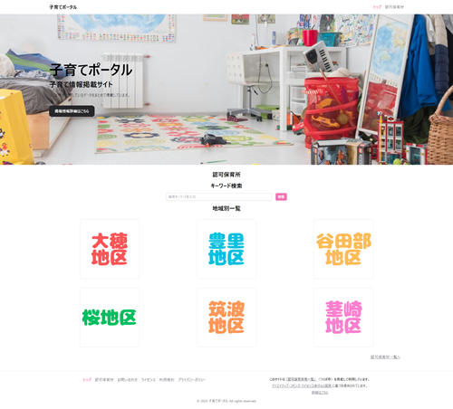

# 子育て支援ポータル


**子育て世帯向けの地域施設情報ポータルサイト**です。  
保育園・こども園などの施設情報を検索・絞り込み・地図表示でき、地域の子育てを支援する情報ハブを目指しています。

**Nuxt 3 + TypeScript** によって構築されたモダンなフルスタックアプリです。

---

## 🌐 デモサイト

👉 [https://kosodate-portal.coolat.net/](https://kosodate-portal.coolat.net/)

---

## 📌 主な機能

| 機能                 | 説明                                             |
| -------------------- | ------------------------------------------------ |
| 🔍 施設名検索        | フリーワード検索による施設情報の検索             |
| 🏷 カテゴリフィルター | 認可／認可外・小規模などカテゴリ別に絞り込み可能 |
| 🗺 Google Maps 表示   | 各施設の所在地を地図上にマーカー表示             |
| 📄 施設詳細画面      | 対象年齢、住所、連絡先などの詳細情報を表示       |
| 📧 問い合わせ        | Nodemailer による問い合わせ送信機能              |

---

## 🛠 使用技術

- **フロントエンド / バックエンド統合**：Nuxt 3 (`^3.16.1`)
- **スタイリング**：Tailwind CSS (`^3.4.17`)
- **型安全**：TypeScript (`^5.7.3`)
- **状態管理/UI**：@nuxt/ui, Composition API
- **データベース**：MongoDB + Mongoose (`^8.11.0`)
- **セキュリティ**：nuxt-csurf による CSRF 対策
- **その他**：Nodemailer（メール送信）、Vercel ホスティング

---

## 💡 開発の工夫

- **API・ルーティングを Nuxt 内で統合**（軽量構成で SPA/SSR 両対応可能）
- **Mongoose スキーマでバリデーション定義**
- **Redesigned UI with @nuxt/ui**（統一感あるコンポーネント設計）
- **Google Maps API との連携**：住所をもとに位置情報をマップに反映

---

## ▶️ ローカル開発手順

```bash
git clone https://github.com/RyoheiTanaka/kosodate-portal.git
cd kosodate-portal
npm install
npm run dev
```

> `.env` ファイルに Google Maps API キー、MongoDB 接続文字列、CSRF 設定などが必要です。

---

## 📸 スクリーンショット

- **トップ画面**  
  
- **検索結果**  
  
- **施設詳細とマップ**  
  

---

## 📄 ライセンス

MIT License  
Copyright (c) 2025 Ryohei Tanaka

このソフトウェアは [MIT ライセンス](./LICENSE) に基づき公開されています。  
商用利用・改変・再配布が自由に可能ですが、著作権表示は保持してください。

---

## 👤 開発者

- **田中 涼平**（[@RyoheiTanaka](https://github.com/RyoheiTanaka)）
- Email: [ryohei.tanaka@coolat.net](mailto:ryohei.tanaka@coolat.net)

---

未来の子育てを、もっとスマートに。  
今後も機能追加と改善を継続していきます 🙌
